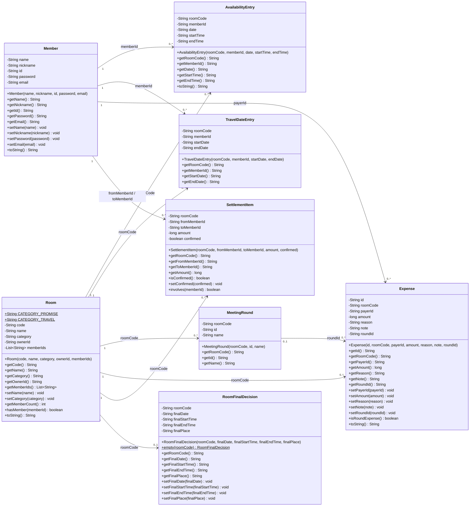

# Model 클래스 다이어그램 정리

## 1. 표기법

- `+` : `public`
- `-` : `private`
- `{static}` : 클래스가 공유하는 정적 멤버
- `{readOnly}` : 생성 후 변경되지 않는 `final` 필드
- `String` : 문자열
- `long` : 큰 정수형 금액
- `boolean` : 참/거짓
- `List<String>` : 문자열 여러 개를 저장하는 목록

생성자는 클래스와 같은 이름으로 표시하며 반환형을 적지 않는다.

---

## 2. 전체 Model 클래스 다이어그램

아래 Mermaid 코드를 Mermaid 지원 편집기에 붙여 넣으면 클래스 다이어그램으로 렌더링할 수 있다.

> 실제 Java 코드가 Model 객체를 직접 참조하는 것은 아니다. `roomCode`, `memberId`,
> `roundId` 같은 문자열 ID로 CSV 데이터 간 관계를 연결한다. 위 화살표는 이러한
> 논리적 관계를 보여준다.

---

## 3. 클래스별 필드와 메서드

## 3.1 `Member`

회원 한 명의 로그인 및 프로필 정보를 저장한다.

### 필드

| 접근 | 필드 | 자료형 | 설명 |
|---|---|---|---|
| `-` | `name` | `String` | 회원의 실명 |
| `-` | `nickname` | `String` | 화면에 표시할 닉네임 |
| `-` | `id` | `String` | 로그인 및 데이터 관계 연결에 사용하는 아이디 |
| `-` | `password` | `String` | 로그인 비밀번호 |
| `-` | `email` | `String` | 이메일 주소 |

### 메서드

| 메서드 | 반환형 | 설명 |
|---|---|---|
| `Member(name, nickname, id, password, email)` | 생성자 | 전달받은 값으로 회원 객체를 생성한다. |
| `getName()` | `String` | 실명을 반환한다. |
| `getNickname()` | `String` | 닉네임을 반환한다. |
| `getId()` | `String` | 로그인 아이디를 반환한다. |
| `getPassword()` | `String` | 비밀번호를 반환한다. |
| `getEmail()` | `String` | 이메일 주소를 반환한다. |
| `setName(name)` | `void` | 실명을 변경한다. |
| `setNickname(nickname)` | `void` | 닉네임을 변경한다. |
| `setPassword(password)` | `void` | 비밀번호를 변경한다. |
| `setEmail(email)` | `void` | 이메일을 변경한다. |
| `toString()` | `String` | 비밀번호를 제외한 주요 회원 정보를 문자열로 반환한다. |

`id`의 Setter가 없으므로 회원가입 후 로그인 아이디는 변경할 수 없다.

---

## 3.2 `Room`

모임방 한 개의 정보와 참여 회원 ID 목록을 저장한다.

### 필드

| 접근 | 필드 | 자료형 | 설명 |
|---|---|---|---|
| `+ {static final}` | `CATEGORY_PROMISE` | `String` | `"단체 약속"` 카테고리 상수 |
| `+ {static final}` | `CATEGORY_TRAVEL` | `String` | `"단체 여행"` 카테고리 상수 |
| `-` | `code` | `String` | 1000~9999 범위의 4자리 방 코드 |
| `-` | `name` | `String` | 방 이름 |
| `-` | `category` | `String` | 단체 약속 또는 단체 여행 |
| `-` | `ownerId` | `String` | 방장 회원의 로그인 ID |
| `-` | `memberIds` | `List<String>` | 현재 방에 참여 중인 회원 ID 목록 |

### 메서드

| 메서드 | 반환형 | 설명 |
|---|---|---|
| `Room(code, name, category, ownerId, memberIds)` | 생성자 | 방 정보를 생성한다. `memberIds`가 null이면 빈 목록을 만든다. |
| `getCode()` | `String` | 방 코드를 반환한다. |
| `getName()` | `String` | 방 이름을 반환한다. |
| `getCategory()` | `String` | 방 카테고리를 반환한다. |
| `getOwnerId()` | `String` | 방장 ID를 반환한다. |
| `getMemberIds()` | `List<String>` | 참여 회원 ID 목록을 반환한다. |
| `setName(name)` | `void` | 방 이름을 변경한다. |
| `setCategory(category)` | `void` | 방 카테고리를 변경한다. |
| `getMemberCount()` | `int` | `memberIds.size()`를 이용해 현재 참여 인원수를 반환한다. |
| `hasMember(memberId)` | `boolean` | 참여자 목록에 해당 ID가 있으면 `true`를 반환한다. |
| `toString()` | `String` | 방 코드, 이름, 카테고리, 인원수를 문자열로 반환한다. |

---

## 3.3 `AvailabilityEntry`

단체 약속에서 회원 한 명이 제출한 가능한 날짜·시간 구간 한 건이다.

### 필드

모든 필드가 `final`이므로 객체 생성 후 변경되지 않는다.

| 접근 | 필드 | 자료형 | 설명 |
|---|---|---|---|
| `- {final}` | `roomCode` | `String` | 일정이 속한 방 코드 |
| `- {final}` | `memberId` | `String` | 일정을 제출한 회원 ID |
| `- {final}` | `date` | `String` | 가능한 날짜, `yyyy-MM-dd` 형식 |
| `- {final}` | `startTime` | `String` | 시작 시간, `HH:mm` 형식 |
| `- {final}` | `endTime` | `String` | 종료 시간, `HH:mm` 형식 |

### 메서드

| 메서드 | 반환형 | 설명 |
|---|---|---|
| `AvailabilityEntry(roomCode, memberId, date, startTime, endTime)` | 생성자 | 가능한 시간 구간 한 건을 생성한다. |
| `getRoomCode()` | `String` | 방 코드를 반환한다. |
| `getMemberId()` | `String` | 제출 회원 ID를 반환한다. |
| `getDate()` | `String` | 가능한 날짜를 반환한다. |
| `getStartTime()` | `String` | 시작 시간을 반환한다. |
| `getEndTime()` | `String` | 종료 시간을 반환한다. |
| `toString()` | `String` | 일정의 모든 필드를 문자열로 반환한다. |

추천 장소는 이 클래스에 저장하지 않는다. 장소는 일정과 별도로 추가·삭제·투표되므로
`PlaceRepository`가 독립적으로 관리한다.

---

## 3.4 `TravelDateEntry`

단체 여행에서 회원 한 명이 제출한 가능한 여행 기간 한 건이다.

### 필드

| 접근 | 필드 | 자료형 | 설명 |
|---|---|---|---|
| `-` | `roomCode` | `String` | 기간이 속한 방 코드 |
| `-` | `memberId` | `String` | 기간을 제출한 회원 ID |
| `-` | `startDate` | `String` | 여행 시작 날짜, `yyyy-MM-dd` 형식 |
| `-` | `endDate` | `String` | 여행 종료 날짜, `yyyy-MM-dd` 형식 |

### 메서드

| 메서드 | 반환형 | 설명 |
|---|---|---|
| `TravelDateEntry(roomCode, memberId, startDate, endDate)` | 생성자 | 가능한 여행 기간 한 건을 생성한다. |
| `getRoomCode()` | `String` | 방 코드를 반환한다. |
| `getMemberId()` | `String` | 제출 회원 ID를 반환한다. |
| `getStartDate()` | `String` | 시작 날짜를 반환한다. |
| `getEndDate()` | `String` | 종료 날짜를 반환한다. |

---

## 3.5 `MeetingRound`

`1차 모임`, `2차 모임`, `뒤풀이`와 같은 모임 회차 한 건이다.

### 필드

| 접근 | 필드 | 자료형 | 설명 |
|---|---|---|---|
| `-` | `roomCode` | `String` | 회차가 속한 방 코드 |
| `-` | `id` | `String` | 회차를 구분하는 UUID |
| `-` | `name` | `String` | 화면에 표시할 회차 이름 |

### 메서드

| 메서드 | 반환형 | 설명 |
|---|---|---|
| `MeetingRound(roomCode, id, name)` | 생성자 | 회차 객체를 생성한다. |
| `getRoomCode()` | `String` | 방 코드를 반환한다. |
| `getId()` | `String` | 회차 고유 ID를 반환한다. |
| `getName()` | `String` | 회차 이름을 반환한다. |

---

## 3.6 `Expense`

방에서 발생한 지출 한 건을 저장한다.

### 필드

| 접근 | 필드 | 자료형 | 설명 |
|---|---|---|---|
| `-` | `id` | `String` | 지출을 구분하는 UUID |
| `-` | `roomCode` | `String` | 지출이 속한 방 코드 |
| `-` | `payerId` | `String` | 실제로 결제한 회원 ID |
| `-` | `amount` | `long` | 결제 금액(원) |
| `-` | `reason` | `String` | 지출 사유 |
| `-` | `note` | `String` | 선택적으로 입력하는 메모 |
| `-` | `roundId` | `String` | 회차별 지출의 회차 ID. 일반 지출이면 빈 문자열 |

### 메서드

| 메서드 | 반환형 | 설명 |
|---|---|---|
| `Expense(id, roomCode, payerId, amount, reason, note, roundId)` | 생성자 | 지출 객체를 생성한다. `roundId`가 null이면 빈 문자열로 바꾼다. |
| `getId()` | `String` | 지출 UUID를 반환한다. |
| `getRoomCode()` | `String` | 방 코드를 반환한다. |
| `getPayerId()` | `String` | 결제자 ID를 반환한다. |
| `getAmount()` | `long` | 결제 금액을 반환한다. |
| `getReason()` | `String` | 지출 사유를 반환한다. |
| `getNote()` | `String` | 메모를 반환한다. |
| `getRoundId()` | `String` | 연결된 회차 ID를 반환한다. |
| `setPayerId(payerId)` | `void` | 결제자를 변경한다. |
| `setAmount(amount)` | `void` | 금액을 변경한다. |
| `setReason(reason)` | `void` | 지출 사유를 변경한다. |
| `setNote(note)` | `void` | 메모를 변경한다. |
| `setRoundId(roundId)` | `void` | 회차 ID를 변경하며 null은 빈 문자열로 바꾼다. |
| `isRoundExpense()` | `boolean` | `roundId`가 비어 있지 않으면 회차별 지출이므로 `true`를 반환한다. |
| `toString()` | `String` | 지출의 전체 필드를 문자열로 반환한다. |

---

## 3.7 `SettlementItem`

정산 결과 중 한 사람이 다른 사람에게 송금해야 하는 관계 한 건이다.

### 필드

| 접근 | 필드 | 자료형 | 설명 |
|---|---|---|---|
| `-` | `roomCode` | `String` | 정산이 속한 방 코드 |
| `-` | `fromMemberId` | `String` | 돈을 보내야 하는 회원 ID |
| `-` | `toMemberId` | `String` | 돈을 받아야 하는 회원 ID |
| `-` | `amount` | `long` | 송금할 금액(원) |
| `-` | `confirmed` | `boolean` | 실제 정산 완료 여부 |

### 메서드

| 메서드 | 반환형 | 설명 |
|---|---|---|
| `SettlementItem(roomCode, fromMemberId, toMemberId, amount, confirmed)` | 생성자 | 송금 관계 한 건을 생성한다. |
| `getRoomCode()` | `String` | 방 코드를 반환한다. |
| `getFromMemberId()` | `String` | 보내는 회원 ID를 반환한다. |
| `getToMemberId()` | `String` | 받는 회원 ID를 반환한다. |
| `getAmount()` | `long` | 송금 금액을 반환한다. |
| `isConfirmed()` | `boolean` | 정산 완료 여부를 반환한다. |
| `setConfirmed(confirmed)` | `void` | 정산 완료 여부를 변경한다. |
| `involves(memberId)` | `boolean` | 해당 ID가 보내는 사람 또는 받는 사람이면 `true`를 반환한다. |

---

## 3.8 `RoomFinalDecision`

방장이 확정한 최종 날짜·시간·장소 한 세트를 저장한다.

### 필드

| 접근 | 필드 | 자료형 | 설명 |
|---|---|---|---|
| `-` | `roomCode` | `String` | 최종 결정이 속한 방 코드 |
| `-` | `finalDate` | `String` | 최종 날짜 또는 여행 날짜 범위 |
| `-` | `finalStartTime` | `String` | 최종 시작 시간. 단체 약속에서 사용 |
| `-` | `finalEndTime` | `String` | 최종 종료 시간. 단체 약속에서 사용 |
| `-` | `finalPlace` | `String` | 최종 장소 |

### 메서드

| 메서드 | 반환형 | 설명 |
|---|---|---|
| `RoomFinalDecision(roomCode, finalDate, finalStartTime, finalEndTime, finalPlace)` | 생성자 | 최종 결정 객체를 생성한다. |
| `empty(roomCode)` | `RoomFinalDecision` | 방 코드 외의 값을 빈 문자열로 채운 새 객체를 반환하는 정적 팩토리 메서드다. |
| `getRoomCode()` | `String` | 방 코드를 반환한다. |
| `getFinalDate()` | `String` | 최종 날짜를 반환한다. |
| `getFinalStartTime()` | `String` | 최종 시작 시간을 반환한다. |
| `getFinalEndTime()` | `String` | 최종 종료 시간을 반환한다. |
| `getFinalPlace()` | `String` | 최종 장소를 반환한다. |
| `setFinalDate(finalDate)` | `void` | 최종 날짜를 변경한다. |
| `setFinalStartTime(finalStartTime)` | `void` | 최종 시작 시간을 변경한다. |
| `setFinalEndTime(finalEndTime)` | `void` | 최종 종료 시간을 변경한다. |
| `setFinalPlace(finalPlace)` | `void` | 최종 장소를 변경한다. |

단체 약속은 날짜·시작 시간·종료 시간·장소를 모두 사용한다. 단체 여행은 날짜 범위와
장소를 사용하며 시작·종료 시간은 사용하지 않는다.

---

## 4. Model 사이의 관계 요약

| 기준 클래스 | 관련 클래스 | 연결 필드 | 관계 |
|---|---|---|---|
| `Room` | `Member` | `ownerId`, `memberIds` | 방장 1명과 참여 회원 여러 명 |
| `Room` | `AvailabilityEntry` | `roomCode` | 방 하나에 약속 일정 여러 건 |
| `Member` | `AvailabilityEntry` | `memberId` | 회원 한 명이 일정 여러 건 제출 |
| `Room` | `TravelDateEntry` | `roomCode` | 방 하나에 여행 기간 여러 건 |
| `Member` | `TravelDateEntry` | `memberId` | 회원 한 명이 여행 기간 여러 건 제출 |
| `Room` | `MeetingRound` | `roomCode` | 방 하나에 회차 여러 개 |
| `Room` | `Expense` | `roomCode` | 방 하나에 지출 여러 건 |
| `Member` | `Expense` | `payerId` | 회원 한 명이 지출 여러 건 결제 가능 |
| `MeetingRound` | `Expense` | `roundId` | 지출은 선택적으로 한 회차와 연결 |
| `Room` | `SettlementItem` | `roomCode` | 방 하나에 송금 관계 여러 건 |
| `Member` | `SettlementItem` | `fromMemberId`, `toMemberId` | 회원이 보내거나 받는 역할로 참여 |
| `Room` | `RoomFinalDecision` | `roomCode` | 방 하나당 최종 결정 최대 한 세트 |
